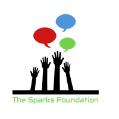

# The_Sparks_Foundation_DS_Intern
<h1> Data Science Intern ( Graduate Rotational Internship Program) Tasks at The Sparks Foundation</h1>

<h2>Task <b> 2 </b>- To Explore Supervised Machine Learning </h2>
<h4>In this regression task we will predict the percentage of marks that a student is expected to score based upon the number of hours they studied. This is a simple linear regression task as it involves just two variables.  
Data can be found at http://bit.ly/w-data  
What will be predicted score if a student study for 9.25 hrs in a
day ?</h4> 
<h2>Task <b> 3 </b>- To Explore Unsupervised Machine Learning </h2>
<h4>From the given ‘Iris’ dataset, predict the optimum number of clusters and represent it visually.  
Dataset : https://drive.google.com/file/d/11Iq7YvbWZbt8VXjfm06brx66b10YiwK-/view?usp=sharing</h4> 
<h2>Task <b> 4 </b>- To Explore Decision Tree Algorithm </h2>
<h4> For the given ‘Iris’ dataset, create the Decision Tree classifier and visualize it graphically. The purpose is if we feed any new data to this classifier, it would be able to predict the right class accordingly  
Dataset :
https://drive.google.com/file/d/11Iq7YvbWZbt8VXjfm06brx66b10YiwK-/view?usp=sharing</h4>
